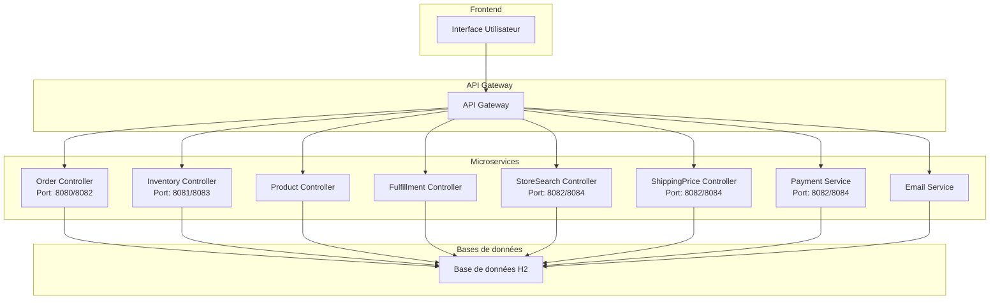

# Projet de Modernisation OMS (Order Management System)

## Vue d'ensemble

Ce projet représente la modernisation d'un système de gestion de commandes (OMS) composé de plusieurs microservices. Chaque microservice a été modernisé selon les principes suivants :

1. **Simplification de l'architecture** : Suppression des dépendances obsolètes comme GemFire
2. **Modernisation des configurations** : Remplacement des configurations XML par des configurations Java
3. **Mise à jour technologique** : Migration vers Spring Boot 2.7.18 pour la compatibilité avec Java 11
4. **Documentation API** : Ajout de la documentation Swagger/OpenAPI pour tous les endpoints
5. **Conteneurisation** : Mise en place de Docker pour faciliter le déploiement
6. **Tests automatisés** : Création de cas de tests JSON pour tous les endpoints REST
7. **Environnement intégré** : Configuration d'environnements Docker avec docker compose

## Architecture du système



## Microservices

### Inventory Controller
- **Description** : Gestion des stocks et inventaires
- **Port local** : 8081
- **Port Docker** : 8083
- **Documentation API** : `/swagger-ui.html`

### Payment Service
- **Description** : Gestion des paiements
- **Port local** : 8082
- **Port Docker** : 8084
- **Documentation API** : `/swagger-ui.html`

### ShippingPrice Controller
- **Description** : Calcul des frais d'expédition
- **Port local** : 8082
- **Port Docker** : 8084
- **Documentation API** : `/swagger-ui.html`

### StoreSearch Controller
- **Description** : Recherche de magasins
- **Port local** : 8082
- **Port Docker** : 8084
- **Documentation API** : `/swagger-ui.html`

### Order Controller
- **Description** : Gestion des commandes
- **Documentation API** : `/swagger-ui.html`

### Product Controller
- **Description** : Gestion des produits
- **Documentation API** : `/swagger-ui.html`

### Fulfillment Controller
- **Description** : Gestion de l'exécution des commandes
- **Documentation API** : `/swagger-ui.html`

### Email Service
- **Description** : Service d'envoi d'emails
- **Documentation API** : `/swagger-ui.html`

## Module commun

Le module `common` contient les entités et utilitaires partagés entre les différents microservices.

## Prérequis

- Java 11
- Maven 3.6+
- Docker et Docker Compose

## Démarrage rapide

### Exécution en mode local

1. Cloner le dépôt :
   ```bash
   git clone [URL_DU_REPO]
   cd oms-modernized
   ```

2. Compiler le projet :
   ```bash
   mvn clean install
   ```

3. Démarrer chaque microservice individuellement :
   ```bash
   cd [nom-du-microservice]
   mvn spring-boot:run
   ```

### Exécution avec Docker

1. Démarrer un microservice avec Docker Compose :
   ```bash
   cd [nom-du-microservice]/docker
   docker compose up -d
   ```

2. Pour démarrer tous les services :
   ```bash
   # Script à créer pour démarrer tous les services
   ./start-all-services.sh
   ```

## Tests

Des cas de tests JSON sont disponibles pour tous les endpoints REST dans le répertoire `docker/json/` de chaque microservice.

Exemple d'utilisation avec curl :
```bash
curl -X POST -H "Content-Type: application/json" -d @docker/json/inventory-controller/getInventory.json http://localhost:8081/api/inventory/get
```

## Documentation API

Chaque microservice expose sa documentation API via Swagger/OpenAPI à l'URL :
```
http://localhost:[PORT]/swagger-ui.html
```

## Structure du projet

```
oms-modernized/
├── common/                     # Module commun avec entités partagées
├── docker/                     # Fichiers Docker communs
│   ├── json/                   # Cas de tests JSON
│   ├── schema.sql              # Schéma de base de données
│   └── data.sql                # Données initiales
├── email-service/              # Service d'envoi d'emails
├── fulfillment-controller/     # Gestion de l'exécution des commandes
├── inventory-controller/       # Gestion des stocks
├── order-controller/           # Gestion des commandes
├── payment-service/            # Gestion des paiements
├── product-controller/         # Gestion des produits
├── shippingprice-controller/   # Calcul des frais d'expédition
└── storesearch-controller/     # Recherche de magasins
```

## Contributions

1. Créer une branche pour votre fonctionnalité
2. Développer et tester votre code
3. Soumettre une pull request

## Licence

Ce projet est sous licence MIT.

```
MIT License

Copyright (c) 2025 OMS Modernization Project

Permission is hereby granted, free of charge, to any person obtaining a copy
of this software and associated documentation files (the "Software"), to deal
in the Software without restriction, including without limitation the rights
to use, copy, modify, merge, publish, distribute, sublicense, and/or sell
copies of the Software, and to permit persons to whom the Software is
furnished to do so, subject to the following conditions:

The above copyright notice and this permission notice shall be included in all
copies or substantial portions of the Software.

THE SOFTWARE IS PROVIDED "AS IS", WITHOUT WARRANTY OF ANY KIND, EXPRESS OR
IMPLIED, INCLUDING BUT NOT LIMITED TO THE WARRANTIES OF MERCHANTABILITY,
FITNESS FOR A PARTICULAR PURPOSE AND NONINFRINGEMENT. IN NO EVENT SHALL THE
AUTHORS OR COPYRIGHT HOLDERS BE LIABLE FOR ANY CLAIM, DAMAGES OR OTHER
LIABILITY, WHETHER IN AN ACTION OF CONTRACT, TORT OR OTHERWISE, ARISING FROM,
OUT OF OR IN CONNECTION WITH THE SOFTWARE OR THE USE OR OTHER DEALINGS IN THE
SOFTWARE.
```
